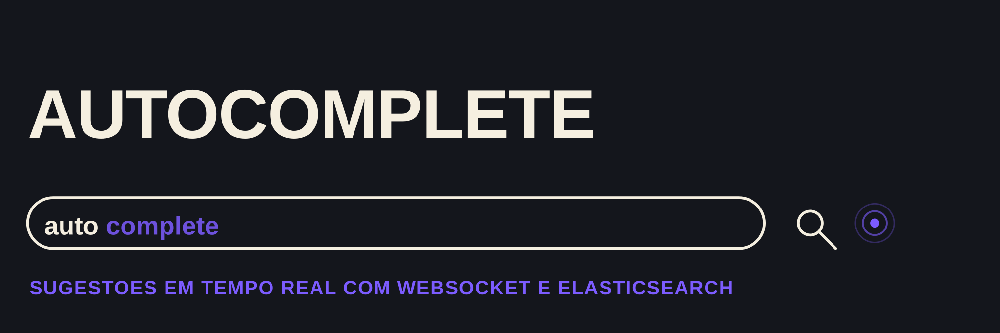

<h4 align="center">Sugestões de busca em tempo real com <a href="https://go.dev/" target="_blank">Go</a>, WebSocket e Elasticsearch.</h4>

<p align="center">
  
  <a href="https://github.com/matheusgb/autocomplete/actions/workflows/ci.yml">
    
  </a>
  <a href="./LICENSE">
    
  </a>
</p>

<p align="center">
  <a href="#funcionalidades">Funcionalidades</a> •
  <a href="#como-funciona">Como funciona</a> •
  <a href="#como-usar">Como usar</a>
</p>

## Funcionalidades

* Indexação de termos no Elasticsearch via HTTP
* Sugestões de autocomplete por busca `wildcard`
* Ranking dos termos mais frequentes via agregação `terms`
* Push das sugestões em tempo real por WebSocket
* Endpoint de health check

## Como funciona

O backend expõe uma rota HTTP para indexar termos e um endpoint WebSocket para
buscá-los. A cada mensagem recebida no socket, o servidor consulta o
Elasticsearch por correspondências parciais do termo digitado e, em paralelo,
recalcula os termos mais frequentes já indexados, devolvendo os dois no mesmo
frame. O frontend (`index.html` + `script.js`) é um cliente mínimo só para
exercitar o fluxo.

## Como usar

### Docker

```
make up
```

Sobe o Elasticsearch e a API já conectados; a API fica em `:8080`.

### Local

Suba o Elasticsearch:

```
docker compose up elasticsearch
```

E rode a API:

```
make run
```

Popule alguns termos de exemplo com `GET /populate`, ou envie os seus com
`POST /send`. Para rodar os testes (precisam do Elasticsearch no ar):

```
make test
```
